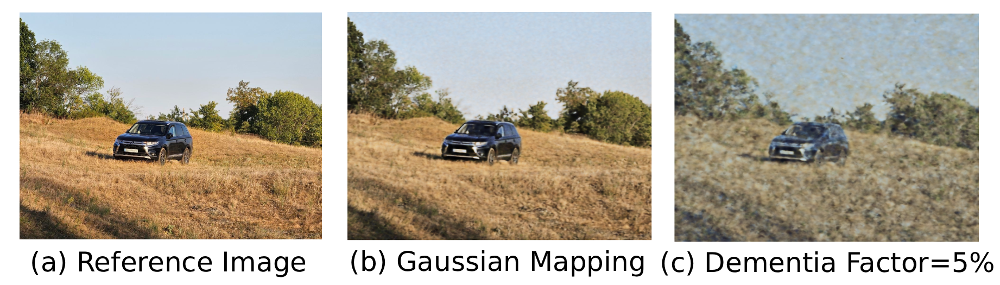

# Fourier Feature Network Image Regression
A Fourier Feature Network implementation for Regression tasks through Implicit Neural Representation. Theoretical and mathematical background is heavily based on the "Fourier Features Let Networks Learn High Frequency Functions in Low Dimensional Domains" by M. Tancik, P. P. Srinivasan, B. Mildenhall et al.

This implementation is mainly focused on 2D Image Regression, however can be configured for 1D and requires minimal modification for 3D Regression tasks. 

The architecture was implemented in PyTorch. Repository also contains a Jupyter Notebook file for Google Colab with a demo. UI for the demo was created using Gradio.

This implementation also introduces the so called "Dementia Factor", which controls the random dropout across MLP layers.

### Implementation Details
#### Architecture:
The model architecture consists of a Fourier Feature Mapping at the input, which is then fed into the Multilayer Perceptron.
MLP consists of regular Linear layers with ReLU activation. The final linear Layer is followed by the Sigmoid activation to properly map the color to the [0 - 1] range. However, logits may be used as well and Sigmoid ommited.

Hidden dimension and number of layers can be configured, as well as the parameters of the FFM. 

#### Fourier Feature Mapping:
The FFM allows the model to learn high-frequency details from the low-dimentional input of just two coordinates, by mapping it into high-dimentional space of non-linear functions.

The mapping is represented mathematically as:

$$\gamma(\mathbf{v}) = \Big[ \cos(2\pi \mathbf{B}\mathbf{v}), \sin(2\pi \mathbf{B}\mathbf{v}) \Big]^T$$

Cosine and Sine functions introduce non-linearity in the input, which helps the network adapt to high-frequency details quicker and allows us to map the input to multiple frequencies, expanding the dimention. The fact that the basis input functions are non-linear also means that the model does not need to spend dozens of iterations learning the non-linearity of the input.

As in the paper, multiple mappings were implemented, namely "Basic" and "Gaussian".

##### Basic mapping:
The basic mapping ommits the B matrix (in the implementation replaces it with an Identity Matrix), which means that the input is only mapped to a single pair of cosine and sine terms with a fixed frequency. This shows little improvement, as the model's Neural Tangent Kernel is still not adaptive enough to make fine steps needed to learn the high-frequency features. Input also stays low-dimentional, as we only double the dimension.

##### Gaussian mapping:
Gaussian mapping introduces the B matrix of size $$\mathbf{B} \in \mathbb{R}^{m \times d}$$, where m is the mapping dimention, which controlls how many frequencies the input is mapped to; and d is the input dimension. The values in B are $$B_{ij} \sim \mathcal{N}(0, \sigma^2)$$, where scale $$\sigma$$ controls the standard deviation of the Normal distribution. This introduces both high-dimentionality and changes the NTK to be stationary and more localized, thus allowing it to learn high-frequency details with much faster convergence. $$\sigma$$ directly controls the "width" of the NTK and the model's ability to learn high-frequency details.

#### Training
The training function allows to parametrize the model and the FFM, as well as the dataset function. Image can be transformed to a different size before training, number of workers with the batch size for the dataloader can be assigned as well.

Mean Squared Error or L2 loss is used as in the paper. The optimizer is Adam, with parameters: $$lr=10^{-3}$$, $$\beta_1=0.9$$, $$\beta_2=0.999$$, $$\epsilon=10^{-8}$$.

#### Evaluation
The evaluation function allows for Super Resolution as well as global configurable dropout.

The Super Resolution expects two parameters, width and height. Once these are set, the evaluation dataset function will compute new input coordinates and pass them to the model. Since the model is an INR, it can interpolate inbetween the points, allowing for theoratically unbounded resolution.

The "Dementia Factor" is a percentage value, which determines how much of the model's weights will be zeroed-out. An individual mask of normally distributed values is created for each Linear layer, which sets to zero all weights that are smaller than the dementia factor in the mask to 0. This ensures proportionate and random "deletion" of weights. 

One might draw parallels to the disease family that affects human brains, resulting in their gradual decay, destroying regions of the brain responsible for memory and other functions. In our case, the "memorized" image starts to loose segments and details, model "forgets" how to recreate certain colors and quickly fades into noise and breaks down after around 50%. Be careful to notice, though, that this does not recreate the actual disease progress and is not accurate to the biological process, at the very least due to the purely random nature of the introduced technique.
